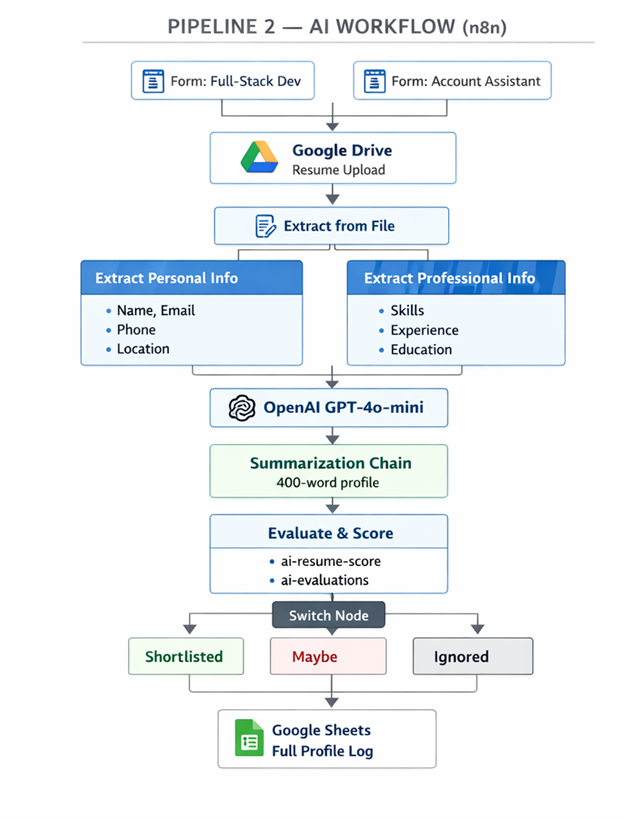

# AI Resume Screener & Job Matcher 🚀

An end-to-end **AI-powered recruitment system** that screens resumes, ranks candidates, and triggers automated hiring workflows using **Machine Learning, Deep Learning, and n8n automation**.

---

## 🧠 System Architecture

### 🔹 Pipeline 1 — ML Screening

<p align="center">
  
</p>

### 🔹 Pipeline 2 — AI Workflow (n8n)

<p align="center">
  
</p>

---

## 🔗 Live Demo & Links

* 🚀 **Deployed App:** AI Resume Screener Pro
* 🔗 **GitHub Repo:** [https://github.com/Shahan-Waheed728/AI-Resume-Screener](https://github.com/Shahan-Waheed728/AI-Resume-Screener)
* 📝 **Medium Article:** How I Built an AI Resume Screener
* 💼 **LinkedIn:** Shahan Waheed

---

## 📖 Project Overview

Hiring teams deal with hundreds of resumes for every job posting. Manual screening is slow, biased, and inefficient. This project solves this with a **dual-pipeline AI system** that screens candidates instantly and logs all results automatically.

---

## ⚙️ Features

* Resume parsing — supports PDF and DOCX formats
* NLP pipeline — tokenization, stopword removal, lemmatization
* TF-IDF vectorization with cosine similarity matching
* Random Forest classifier — Qualified / Not Qualified (~90% accuracy)
* ANN match scorer — candidate match score (0–100%)
* Adjustable hire threshold via recruiter sidebar
* n8n automation — GPT-powered candidate profiling workflow
* Google Sheets logging — real-time results tracking
* Deployed on Streamlit Cloud

---

## 🧠 Model Performance

### Random Forest Classifier

| Metric     | Score         |
| ---------- | ------------- |
| Accuracy   | 89.92%        |
| Precision  | 82.89%        |
| Recall     | 82.35%        |
| F1 Score   | 82.62%        |
| CV Mean F1 | 81.89% ± 2.6% |

### ANN Model (Match Scorer)

* Architecture: 512 → 256 → 128 → 64 → 1
* Activation: Sigmoid (0–1)
* Loss: Binary Crossentropy
* Optimizer: Adam (lr=0.001)
* Regularization: BatchNorm + Dropout

> Note: ANN works as a regression-style scorer producing a continuous match percentage.

---

## 🛠️ Tech Stack

* **Language:** Python 3
* **ML:** Scikit-learn (Random Forest)
* **Deep Learning:** TensorFlow / Keras
* **NLP:** NLTK, TF-IDF, Cosine Similarity
* **Frontend:** Streamlit
* **Automation:** n8n
* **AI:** OpenAI GPT-4o-mini
* **Storage:** Google Sheets, Google Drive
* **Version Control:** Git + GitHub

---

## 📂 Project Structure

```
AI-Resume-Screener/
├── app/
│   └── app.py
├── data/
├── models/
├── n8n_workflow/
├── src/
├── .streamlit/
├── requirements.txt
└── README.md
```

---

## ▶️ Run Locally

```bash
git clone https://github.com/Shahan-Waheed728/AI-Resume-Screener.git
cd AI-Resume-Screener

python -m venv venv
venv\\Scripts\\activate

pip install -r requirements.txt

streamlit run app/app.py
```

---

## 👨‍💻 Author

**Shahan Waheed**
Software Engineering Student (7th Semester)
COMSATS University Attock

---

## 📄 License

MIT License — free to use with attribution.
